```mermaid
flowchart TB
    Start([User starts migration]) --> Review[Review IMPLEMENTATION_COMPLETE.md]
    Review --> CheckCreds{GitHub<br/>credentials<br/>configured?}
    
    CheckCreds -->|No| SetupCreds[Setup: gh auth login<br/>or git credential helper]
    SetupCreds --> Step1
    CheckCreds -->|Yes| Step1
    
    Step1[Execute: publish-to-github.sh] --> Clone[Clone Dev-Tools repo<br/>to /tmp/Dev-Tools]
    Clone --> Copy[Copy dev-tools-package<br/>contents]
    Copy --> CreateFiles[Create config files:<br/>package.json, LICENSE, etc.]
    CreateFiles --> CreateDocs[Create documentation:<br/>MANIFEST, CHANGELOG, etc.]
    CreateDocs --> CopyProvenance[Copy provenance docs:<br/>REPO_RESTRUCTURE_PLAN, coverage]
    CopyProvenance --> CreateCI[Create GitHub Actions<br/>CI workflow]
    CreateCI --> Commit1[Commit with detailed<br/>message + source SHA]
    Commit1 --> ConfirmPush1{Push to<br/>remote?}
    
    ConfirmPush1 -->|y| Push1[Push to prospect-pro-tools<br/>branch]
    ConfirmPush1 -->|n| Stop1[Abort: Can push later]
    
    Push1 --> ConfirmTag{Push v1.0.0<br/>tag?}
    ConfirmTag -->|y| PushTag[Push tag with<br/>release notes]
    ConfirmTag -->|n| Stop2[Abort: Can push tag later]
    
    PushTag --> Verify[Step 2: Verify on GitHub]
    Verify --> CheckBranch{prospect-pro-tools<br/>branch exists?}
    CheckBranch -->|No| FixPublish[Review errors,<br/>retry Step 1]
    CheckBranch -->|Yes| CheckTag{v1.0.0<br/>tag exists?}
    CheckTag -->|No| FixPublish
    CheckTag -->|Yes| Step3
    
    Step3[Execute: integrate-submodule.sh] --> Backup[Create backup:<br/>/tmp/dev-tools-package-backup-*.tar.gz]
    Backup --> ConfirmRemove{Continue with<br/>removal?}
    ConfirmRemove -->|n| Abort[Abort integration]
    ConfirmRemove -->|y| Remove[Remove workspace<br/>dev-tools-package/]
    Remove --> AddSubmodule[Add git submodule<br/>pointing to Dev-Tools]
    AddSubmodule --> InitSubmodule[Initialize and update<br/>submodule recursively]
    InitSubmodule --> VerifyGitmodules[Verify .gitmodules<br/>configuration]
    VerifyGitmodules --> UpdateIgnore[Update .gitignore]
    UpdateIgnore --> NPMInstall[Run npm install]
    NPMInstall --> RunValidation[Run validation script]
    RunValidation --> RunTests[Run tests and linter]
    RunTests --> ConfirmCommit{Create<br/>commit?}
    
    ConfirmCommit -->|n| Stop3[Abort: Can commit later]
    ConfirmCommit -->|y| Commit2[Commit .gitmodules<br/>and submodule pointer]
    Commit2 --> ConfirmPush2{Push to<br/>remote?}
    
    ConfirmPush2 -->|n| Stop4[Success: Can push later]
    ConfirmPush2 -->|y| Push2[Push to remote]
    
    Push2 --> Step4[Step 4: Validate Integration]
    Step4 --> CheckStatus[Check: git submodule status]
    CheckStatus --> CheckGitmodules[Verify: cat .gitmodules]
    CheckGitmodules --> RunTaskValidate[Run: task submodule:validate]
    RunTaskValidate --> AllChecks{All checks<br/>pass?}
    
    AllChecks -->|No| Troubleshoot[Review errors<br/>and troubleshoot]
    Troubleshoot --> RollbackQ{Need to<br/>rollback?}
    RollbackQ -->|Yes| Rollback[Restore from backup:<br/>tar -xzf /tmp/dev-tools-package-backup-*]
    RollbackQ -->|No| FixIssues[Fix issues and retry]
    
    AllChecks -->|Yes| UpdateDocs[Update documentation:<br/>settings-staging.md]
    UpdateDocs --> Phase5[Ready for Phase 5:<br/>Remove legacy dev-tools/]
    Phase5 --> Complete([Migration Complete ✅])
    
    Stop1 -.Manual push later.-> Verify
    Stop2 -.Manual push later.-> Verify
    Stop3 -.Manual commit later.-> Step4
    Stop4 -.Manual push later.-> Step4
    FixPublish -.-> Step1
    FixIssues -.-> Step3
    Rollback -.-> Step3
    Abort -.Restore if needed.-> Start

    style Start fill:#e1f5fe
    style Complete fill:#c8e6c9
    style Step1 fill:#fff9c4
    style Step3 fill:#fff9c4
    style Step4 fill:#fff9c4
    style Backup fill:#ffecb3
    style Rollback fill:#ffccbc
    style Abort fill:#ffccbc
    style AllChecks fill:#f3e5f5
    style ConfirmPush1 fill:#f3e5f5
    style ConfirmPush2 fill:#f3e5f5
    style ConfirmTag fill:#f3e5f5
    style ConfirmRemove fill:#f3e5f5
    style ConfirmCommit fill:#f3e5f5
```

## Workflow Explanation

### Phase 1: Publication (publish-to-github.sh)
1. **Preparation**: Clone Dev-Tools repo, create branch
2. **Content**: Copy all dev-tools-package files
3. **Configuration**: Create package.json, tsconfig.json, LICENSE, .gitignore
4. **Documentation**: Create MANIFEST, CHANGELOG, provenance docs
5. **Automation**: Create GitHub Actions CI workflow
6. **Finalization**: Commit, push branch, push tag (with confirmations)

### Phase 2: Verification
- Check GitHub for branch existence
- Check GitHub for tag existence
- Optional: Review CI status

### Phase 3: Integration (integrate-submodule.sh)
1. **Safety**: Create backup of workspace directory
2. **Removal**: Remove workspace copy (with confirmation)
3. **Submodule**: Add git submodule pointing to Dev-Tools
4. **Validation**: Run npm install, tests, lint
5. **Finalization**: Commit and push (with confirmations)

### Phase 4: Validation
- Check submodule status with git
- Verify .gitmodules configuration
- Run comprehensive validation with task
- Update documentation

### Rollback Points
- **Before push**: Answer 'n' to confirmation prompts
- **After integration fails**: Restore from backup
- **After partial push**: Use git to revert commits

### Safety Features
- ✅ Backups created before destructive operations
- ✅ Multiple confirmation prompts
- ✅ Can abort at any stage
- ✅ Clear rollback procedures
- ✅ Validation at each step
